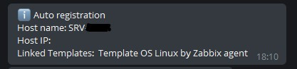
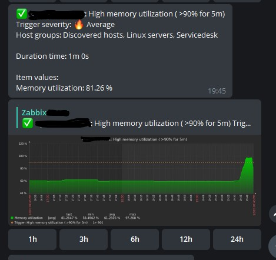
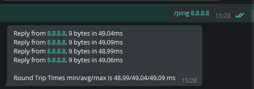

# ZabbixBot

**Run bot:**

Requirments: docker, docker-compose.

For start bot:
1) Download project

`git clone https://github.com/Gyzes/zabbixbot.git`

2) Change .env.sample and rename to ".env"

3) Start containers:

`docker-compose up -d`

**Configure HTTPS**
Generate self-signed certificate

`openssl req -x509 -newkey rsa:2048 -keyout key.pem -out ca.pem -days 1080 -nodes -subj '/CN=*/O=My Company Name LTD./C=US'`

`cp key.pem cert.pem`

`cat ca.pem >> cert.pem`

`awk 1 ORS='\\n' cert.pem`

**Configure notifications in Zabbix:**

1) Import media types from zbx_mediatypes.yaml
2) Change address for send notification
3) In user media type set Telegram id
4) Configure Action for send notification

For disable send graph for trigger set tag: graph with value "False"

**Examples**

1) Autoregistration

2) Trigger

3) Ping

